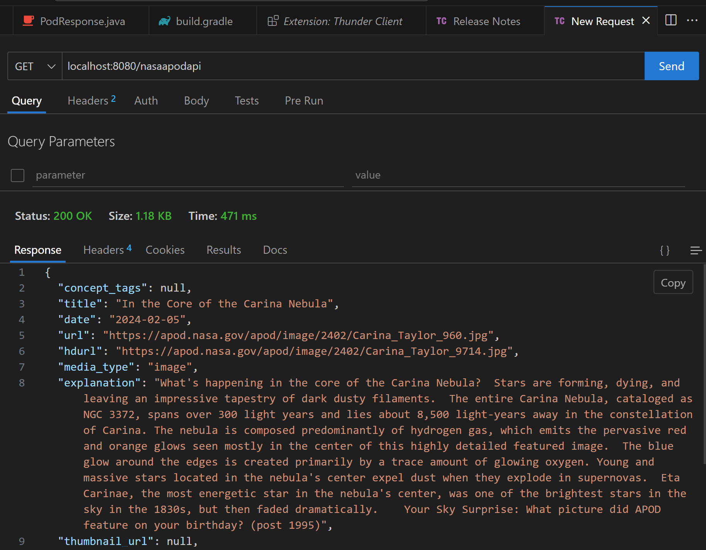
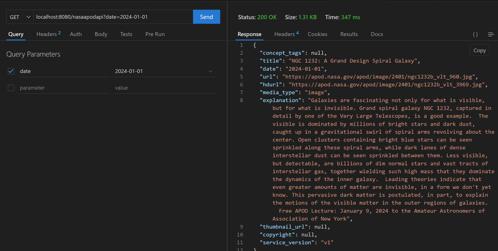
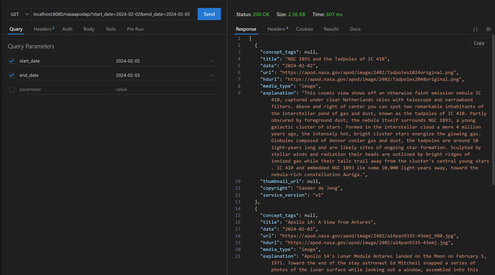
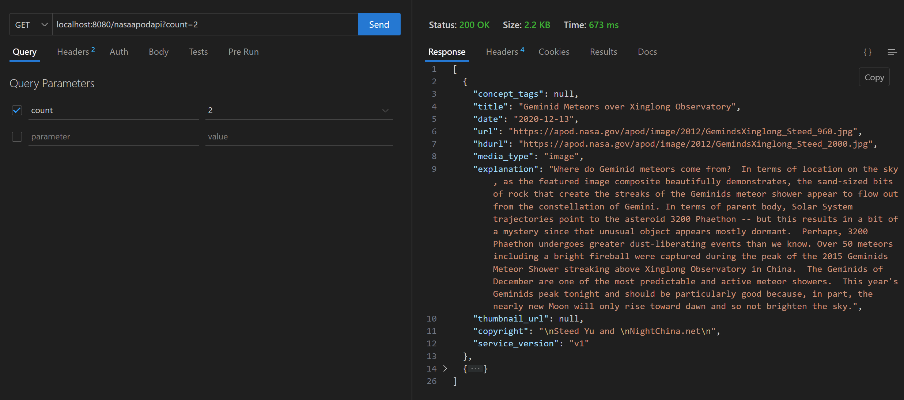

---

# NASA APOD API Integration Project

## Introduction

This project integrates with NASA's Astronomy Picture of the Day (APOD) API, providing an easy-to-use service for retrieving daily astronomical images along with their detailed descriptions. It's built using Spring Boot, making it robust and scalable for various applications, from educational tools to daily image feeds for space enthusiasts.

The service encapsulates API calls to NASA's APOD service, handling query parameters dynamically to fetch either a single image detail or a list of images based on specified criteria. This simplifies the consumption of NASA's APOD API by abstracting away the direct API calls and providing a clean, intuitive interface for developers.

## Features

- Fetch the Astronomy Picture of the Day including its title, explanation, and media type.
- Retrieve historical APOD images by specifying a date range.
- Get a random set of APOD images based on a specified count.
- Support for both standard and high-definition image URLs.

## API Usage

### Endpoints

`/nasaapodapi`: Fetches APOD data based on the provided query parameters.

### Query Parameters

- `date`: Specifies the date of the APOD to fetch (format: YYYY-MM-DD). If omitted, the API fetches today's APOD.
- `start_date`: The start date of a date range for fetching historical APOD images.
- `end_date`: The end date of a date range for fetching historical APOD images.
- `count`: The number of random APOD images to fetch. Useful for generating image galleries.
- `thumbs`: Specifies whether to include thumbnail URLs in the response. Set to `true` to include thumbnails.

### Example Requests

**Fetch today's APOD:**

```
GET /nasaapodapi
```


**Fetch APOD for a specific date:**

```
GET /nasaapodapi?date=2024-01-01
```


**Fetch APOD images for a date range:**

```
GET /nasaapodapi?start_date=2022-01-01&end_date=2022-01-10
```


**Fetch 5 random APOD images:**

```
GET /nasaapodapi?count=2
```



---
### Requirements

- java >= 17
- Gradle
- spring web

---
## command to run project after clone
> gradle bootrun